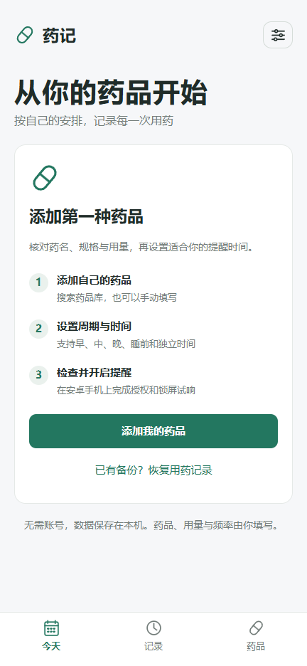
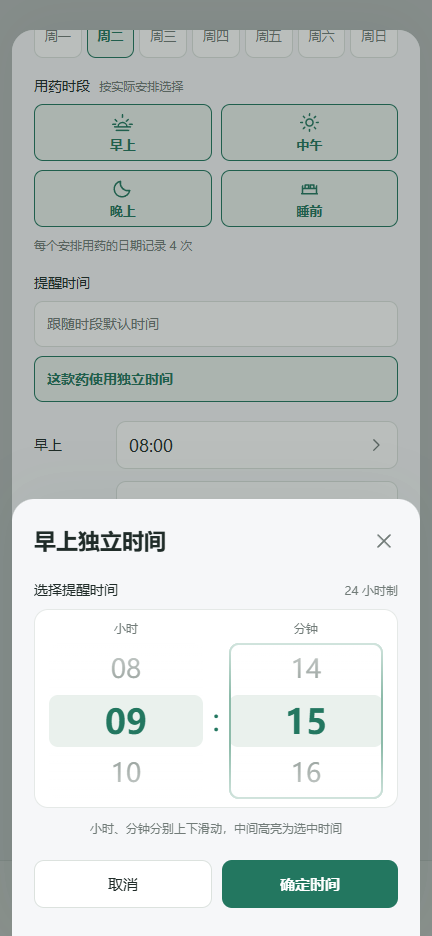

# 药记（Medtime）

一个完全离线的 Android 用药记录与辅助提醒工具，数据保存在设备本地，无需账号。

当前版本 **1.7.1**。

- 全新安装从空列表开始，引导添加自己的药品、核对信息、设置实际频率并检查提醒。
- 支持规格、剂型、默认每次用量，以及每款药的独立提醒时间、早中晚和睡前四个时段；点击独立时间弹出小时／分钟两列上下滑动选择器。
- 疗程结束日期、暂停安排和归档；保留历史记录，归档移回后保持暂停。
- 原生后台提醒；通知仅保留“停止响铃”和“打开药记”，支持音量／授权检查及需用户确认结果的锁屏试响。
- 90 项名称库，中文／拼音／首字母搜索，记录编辑、删除、撤销、累计次数和 JSON 备份。

药品库仅用于名称查找，应用不提供诊断、处方或个体化治疗建议。药品、用量和频率由用户核对填写。

## 下载与使用

[下载 Android APK（1.7.1）](./medtime-1.7.1.apk?raw=true) · [SHA-256](./medtime-1.7.1.apk.sha256) · [使用说明与真机测试步骤](./使用说明.md)

最低 Android 8.0（API 26），目标 Android 15（API 35）。本次包名和签名不变，可覆盖升级；旧数据和已设置的时段开关保留；旧版没有睡前时段时初始为关闭。升级前建议导出备份，不要先卸载旧版。

**目前尚未在实体 Android 设备或模拟器上验证响铃和系统权限。** 已完成的编译、规则和浏览器检查不能证明真实设备的声音、振动、锁屏或厂商省电兼容性。首次使用请按说明完成锁屏试响；系统触发和播放器启动不会自动记作“实际听到”。

## 界面预览

  
  

第二张截图使用单独的演示数据，不包含在安装包中，也不代表真实个人用药或推荐剂量。

## 提醒与数据规则

每个时段的开关控制该时段内全部药品，包括使用独立时间的药品；药品下方显示实际安排时间。暂停、归档或疗程结束会停止对应安排，已保存的历史仍保留。

1.7.1 移除了稍后提醒，并清理旧版本待触发的延后队列。安卓通知只有停止响铃和打开药记两个操作。停止声音不自动完成或新增用药记录。

新版本读取旧备份并迁移到 v4；1.7.0 扩展备份需本版或兼容更新版本恢复。导入保留本机已有信息、记录以及暂停／归档状态。设备时段开关、系统权限和试响结果不写入药品 JSON 备份。

## 源码

| 目录 | 内容 |
| --- | --- |
| web/ | 离线界面、名称库、数据规则、提醒设置和时间滚轮 |
| android/ | 原生排程、通知、响铃、系统权限、文件选择器与构建脚本 |
| tests/ | Node 数据测试及纯 Java 日历规则测试 |
| design/ | 界面说明和预览图 |
| 使用说明.md | 安装、设置、备份、记录和手机验收步骤 |
| 药品库说明.md | 内置名称、分类和来源 |

## 本地构建与测试

在 android 目录使用 Windows PowerShell：

    powershell -NoProfile -ExecutionPolicy Bypass -File .\prepare-toolchain.ps1
    powershell -NoProfile -ExecutionPolicy Bypass -File .\build.ps1

准备脚本从官方站点下载固定版本便携工具并校验 SHA-256。工具链、中间产物和本地签名放在本仓库 work/android-build，已由 .gitignore 排除。发布包的私有签名没有上传；新生成的签名不能覆盖此处提供的 APK。

仓库根目录运行数据测试（Node.js 18+）：

    node --test tests/store.test.cjs tests/catalog-stats.test.cjs tests/reminders.test.cjs tests/dose.test.cjs tests/management.test.cjs

原生规则测试命令见 [Android 工程说明](./android/README.md)。网页可用静态服务器预览，后台闹钟只在安卓安装版提供。

1.7.1 已通过 **57 项 Node 测试、53 项纯 Java 断言、13 组浏览器检查**。浏览器使用 Edge／Playwright，覆盖 320、360、432、1280 像素宽度；页面、控制台、横向溢出和截图检查通过。重点验证真实触摸滑动、两列独立变化、吸附、确认／取消／返回、保留安排草稿、边界时间保存与默认时间回归。Android 接口使用显式模拟，只验证参数及界面。

APK 已通过资源／Java／DEX 编译、逐个网页资源哈希、ZIP 对齐和 v2/v3 签名检查。

## 隐私与开源协议

应用不申请网络、定位、相机或广泛存储权限。数据仅保存在应用私有存储，卸载或清除数据会删除记录，请定期导出备份。备份含个人用药信息，请妥善保存。

按 [MIT License](./LICENSE) 发布。Android SDK、JDK、系统 WebView 等第三方组件受各自许可证约束。
