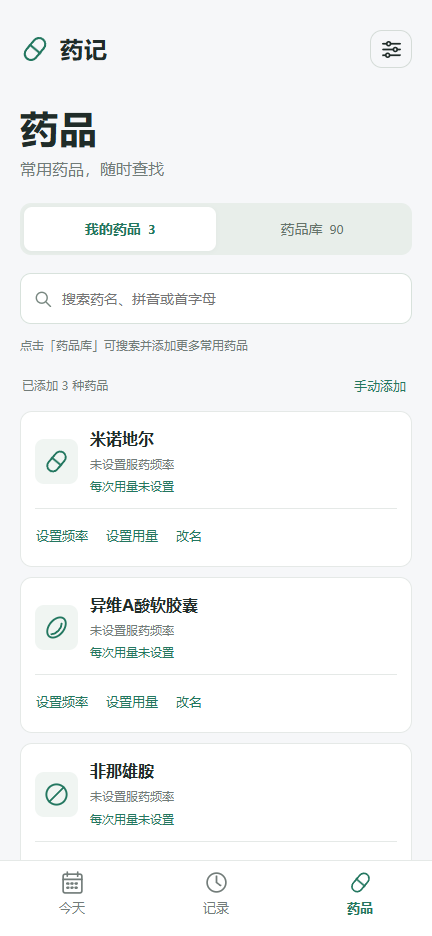
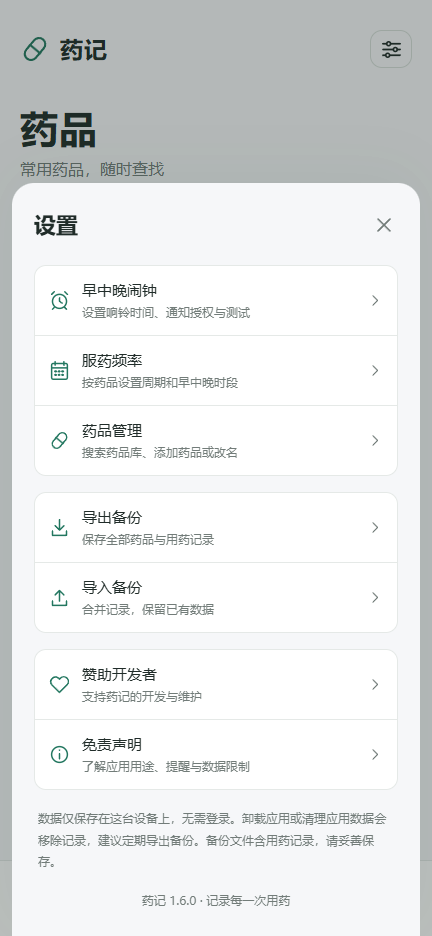

# 药记（Medtime）

一个离线优先的 Android 用药记录工具。数据只保存在设备本地，不需要账号或网络。

当前版本 1.6.0，包含：

- 90 项内置药品和营养补充品，可按中文、拼音、首字母和类别搜索。
- 个人药品的服药频率、每次用量、早中晚安排和累计次数统计。
- 首页早、中、晚独立闹钟，双列小时/分钟滚轮，以及 Android 锁屏和后台提醒支持。
- 首页记录与“补记用药”入口，记录可编辑、删除和撤销；数据支持 JSON 导入导出。
- 设置中的用途说明、提醒限制和数据保管免责声明。

应用不提供诊断、处方或个体化治疗建议。药品库名称用于查找，不代表推荐或长期使用建议；请按医生、药师或产品说明核对用药信息。

## 下载

[下载 Android APK（1.6.0）](./medtime-1.6.0.apk?raw=true) · [SHA-256 校验](./medtime-1.6.0.apk.sha256) · [使用说明](./使用说明.md)

最低支持 Android 8.0（API 26），目标 Android 15（API 35）。已有安装可直接覆盖升级；同一签名的版本会保留应用数据。当前 APK 是个人本地签名包，不代表应用商店发布版本。

## 界面预览

<p>
  
  
</p>

预览使用空记录的独立页面，安装包不包含测试用药记录。

## 源码目录

| 目录 | 内容 |
| --- | --- |
| `web/` | 离线 WebView 界面、药品库、数据存储、提醒设置和时间滚轮 |
| `android/` | Android WebView 包装、原生闹钟排程、通知和响铃服务 |
| `tests/` | Node 数据测试和原生闹钟日历规则测试 |
| `design/` | 界面说明和预览图 |
| `使用说明.md` | 面向用户的安装、用药记录、备份和提醒说明 |
| `药品库说明.md` | 内置名称、分类和来源说明 |

## 本地构建

在 `android/` 目录运行：

```powershell
powershell -NoProfile -ExecutionPolicy Bypass -File .\prepare-toolchain.ps1
powershell -NoProfile -ExecutionPolicy Bypass -File .\build.ps1
```

首次准备脚本从 Microsoft 和 Google 官方站点下载固定版本的便携 JDK、Android Platform 和 Build Tools，并校验 SHA-256。工具链、构建中间产物和本地签名文件默认放在本仓库的 `work/android-build/`，已由 `.gitignore` 排除。发布包的私有签名未上传；另一台电脑生成的签名无法覆盖本仓库提供的 APK。构建自己的版本时可传入新的 `-WorkRoot` 和 `-OutputApk`。

在仓库根目录运行数据测试（Node.js 18 或更新版本）：

```powershell
node --test tests/store.test.cjs tests/catalog-stats.test.cjs tests/reminders.test.cjs tests/dose.test.cjs
```

原生 `AlarmPlan` 测试的编译命令见 [`android/README.md`](./android/README.md)。浏览器测试使用本地静态服务器和 Playwright；它们不能代替实体 Android 设备对系统授权、后台响铃、声音和振动的验证。

发布验证：46 项 Node 数据测试通过；1.6 界面已通过 18 组浏览器检查，覆盖 320、360、432 像素手机宽度和桌面。APK 已检查资源、对齐及签名，尚未在实体 Android 设备或模拟器上验证系统响铃与授权表现。

## 隐私和数据

应用默认不联网，不申请网络、定位、相机或广泛存储权限。药品、频率、用量和记录保存在应用私有存储中；卸载或清除应用数据可能删除它们，请定期导出备份。设备闹钟开关和系统授权属于当前设备设置，不写入 JSON 备份，换机后需要重新开启。

## 开源协议

本项目按 [MIT License](./LICENSE) 发布。Android SDK、JDK、系统 WebView 和其他第三方组件仍受各自许可证约束。
