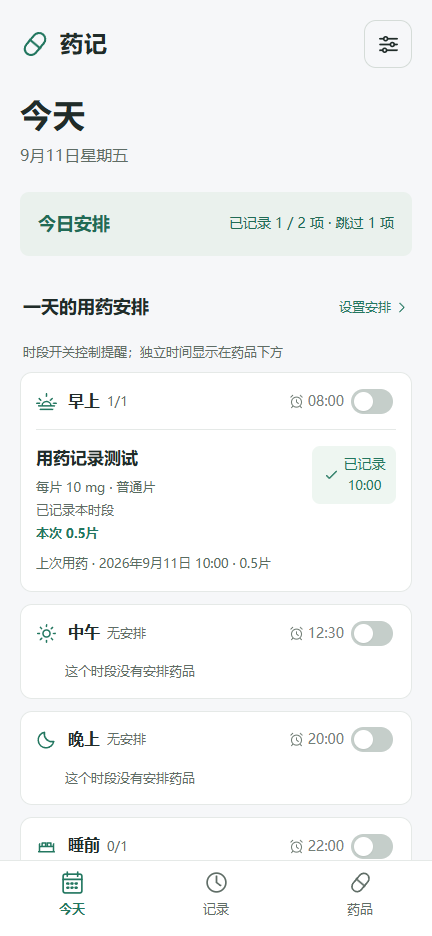
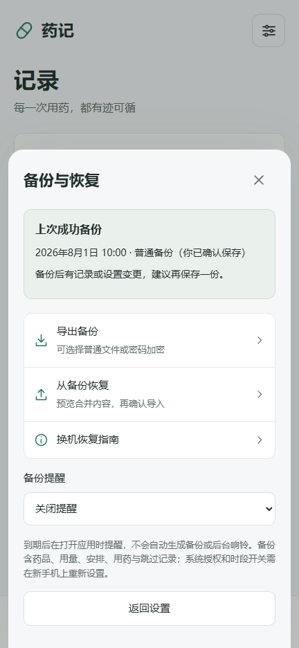
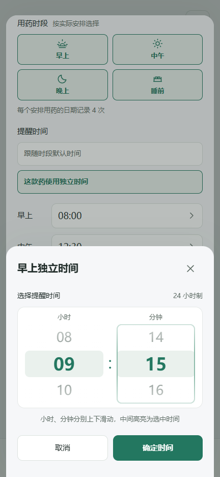
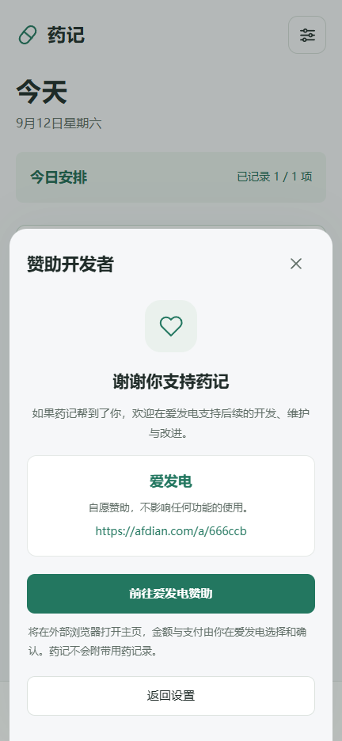

# 药记（Medtime）

完全离线的 Android 用药记录与辅助提醒工具，数据保存在设备本地，无需账号。

当前版本 **1.8.1**。新安装不预置药品、用量、频率或演示记录。

- 记录实际用药时间与用量，展示上次记录，支持编辑、删除、撤销、补记和同一分钟重复记录确认。
- 本次跳过与原因独立保存，不计入用药次数；近 7 天概览分别汇总用药与跳过。
- 自定义药品规格、剂型、周期、独立时间、早中晚／睡前、疗程结束日期，支持暂停与归档保留历史。
- Android 原生提醒、系统权限与音量检查、需用户确认结果的锁屏试响。通知保留停止响铃和打开药记两个操作。
- 普通／密码加密备份、成功保存时间、定期备份提示与换机恢复指南。
- 跟随系统字号、可选大字模式、扩大点击区域、改善弹窗焦点和读屏标签。
- 应用内更新说明、GitHub 反馈、隐私政策与免责声明。
- 通过[爱发电](https://afdian.com/a/666ccb)自愿赞助开发者，点击后在外部浏览器打开，功能使用不受赞助影响。

药品库只帮助查找名称，不推荐药物或用量。应用不提供诊断、处方或个体化治疗建议。

## 下载与使用

[下载 Android APK（1.8.1）](./medtime-1.8.1.apk?raw=true) · [SHA-256](./medtime-1.8.1.apk.sha256) · [使用说明](./使用说明.md) · [更新记录](./CHANGELOG.md)

最低 Android 8.0（API 26），目标 API 35。包名与原签名一致，可覆盖已有药记。升级前建议先导出备份，不要卸载旧版；旧药品、历史和提醒开关保留。

**尚未完成实体 Android 设备验证。** 浏览器、编译和日历规则通过，不能证明真实设备的锁屏、过夜、省电、重启、权限行为、系统文件保存或 TalkBack。请按使用说明完成验收。

## 界面预览

  
  
  
  

截图为独立测试数据，不包含在安装包中，也不是用药建议。

## 数据与提醒

时段开关控制该时段内全部药品，包括使用独立时间的药品。暂停、归档、疗程结束以及当天对应时段已用药／已跳过，会停止对应待提醒。

停止声音不自动记录用药。跳过独立存储，可撤销；实际补记同药同日同时段会清除对应跳过。没有记录仅显示未记录，不推断漏服。

药品存储结构为 v5，可迁移 v1–v4，旧记录不补造跳过状态。备份合并保留已有信息和记录。加密文件需要密码；忘记密码无法找回。新备份需用 1.8.0 或兼容更新版本恢复。

时段默认时间、开关、系统授权、显示和备份偏好、试响结果不写入药品备份，换机时需重新设置。

## 源码与测试

| 路径 | 内容 |
| --- | --- |
| web/ | 界面、数据、名称库、备份加解密、偏好和时间滚轮 |
| android/ | 原生排程、通知、响铃、系统权限、文件选择器与构建 |
| tests/ | Node 测试及纯 Java 规则测试 |
| design/ | 界面说明和预览图 |
| PRIVACY.md | 独立隐私政策 |
| 发布准备.md | Google Play 材料草稿与尚未完成的提交步骤 |

Windows PowerShell 中进入 android 目录构建：

    powershell -NoProfile -ExecutionPolicy Bypass -File .\prepare-toolchain.ps1
    powershell -NoProfile -ExecutionPolicy Bypass -File .\build.ps1

工具链和签名留在仓库的 work/android-build，已被 .gitignore 排除。公开源码不含原发布私钥；自行生成的签名不能覆盖本项目下载的 APK。构建参数与纯 Java 测试见 [Android 工程说明](./android/README.md)。

仓库根目录运行（本版使用 Node.js 24 验证，建议 Node.js 22+）：

    node --test tests/*.test.cjs

1.8.1 通过 **24 组浏览器检查**（8 组赞助入口检查、16 组功能与备份回归）。Edge／Playwright 覆盖 320／360／432／1280 宽度、200% 系统字号与赞助页 250% 字号，检查点击前不跳转、精确外链、返回与焦点、原记录不变、隐私文案和无控制台错误。爱发电导航在测试中拦截，Android 接口明确模拟，未验证在线页面、支付或真机跳转。

数据与排程规则沿用 1.8.0，先前已有 70 项 Node 测试、61 项 Java 断言及 35 组浏览器检查通过。源码保留这些规则测试。

APK 构建检查资源、Java、DEX、ZIP 对齐、签名和逐个网页资源哈希。构建通过不代替手机验收。

## 隐私与维护

[隐私政策](./PRIVACY.md) · [问题反馈](https://github.com/1841175465li-byte/medtime/issues) · [发布准备](./发布准备.md)

无网络、联系人、位置、相机或广泛存储权限；无需账号，没有广告和统计 SDK。外部反馈与爱发电赞助只在用户点击后交给浏览器，不自动附带用药数据或发送信息；金额与支付由用户在平台确认，药记不读取交易或赞助状态。

按照 [MIT License](./LICENSE) 开源；Android SDK、JDK 和系统 WebView 遵循各自许可证。
